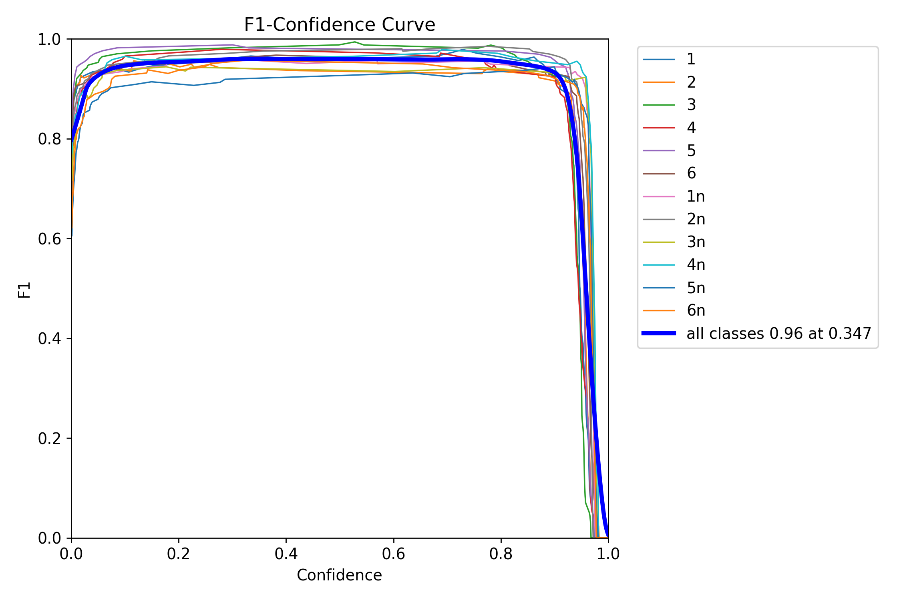

# ML Training

## Requirements
See [requirements.txt](requirements.txt) with python 3.11.10

## Training
The model was trained by running the yolo_train.py file with the initial model as yolov10s.pt. 

Many different augmentation settings and hyperparameters were tried, including,
- epochs: 100-200  
- warmup epochs: 3-10  
- close mosaic: 10-50  
  - the number of epochs at the end where mosiac augmentation is disabled
- deterministic: True/False
- erasing: 0.0-0.4  
  - probability of 10-90% of the image to be erased
- cos_lr: True/False  
  - cosine learning rate
- cls: 0.5-1.0
  - weight of classification loss
- box: 6.5-7.5
  - weight of bounding box loss
- dfl: 1.0-2.0
  - weight of distribution focal loss
- fliplr: 0.0-0.5
  - chance of flipping the image left to right

Other than these, the default YOLO training settings suited our task, and so were not changed.

## Export
The model was exported in the tflite format (also onnx and tensorflow) by running the yolo_export.py file.

## Testing/Metrics
The model was evaluated on the test dataset by running the yolo_val.py file. The following metrics were achieved.

  
  
  
  
  
  

## Final Model
The final model can be found in all 4 formats (pt, onnx, pb, tflite 32bit, tflite 16bit) in [runs/detect/4_2_200_s/weights](runs/detect/4_2_200_s/weights).
